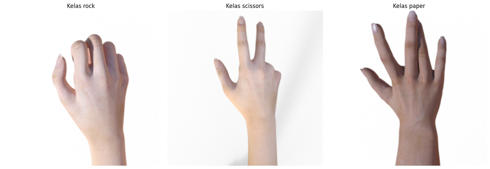

# RPS - Prediction

**Rock Paper Scissors Prediction**
Proyek ini bertujuan untuk melakukan klasifikasi gambar rock, paper, dan scissors menggunakan model transfer learning VGG19. Dengan menggunakan Flask, aplikasi web ini memungkinkan pengguna untuk mengunggah gambar tangan rock, paper, dan scissors, dan kemudian memberikan prediksi dari model VGG19 terhadap gambar tersebut.

### Fitur 
* Menggunakan arsitektur VGG19 untuk klasifikasi gambar rock, paper, dan scissors.
* Aplikasi web sederhana dengan antarmuka pengguna menggunakan Flask.
* Pengguna dapat mengunggah gambar dan menerima prediksi dari model VGG19.
* Menggunakan TensorFlow dan Keras sebagai dasar untuk pemodelan dan prediksi.

**Pre-Rquirements :**

- [x] numpy
- [x] opencv-python
- [x] pillow
- [x] Flask
- [x] Tensorflow

## Dataset
Dataset yang digunakan merupakan kumpulan citra tangan paper, rock, dan scissors yang berjumlah 2520 gambar.
berikut merupakan contoh gambar dari masing masing kelas yang ada :

Dataset yang ada dibagi menjadi 3 bagian menjadi data train, validation, dan test, dengan proporsi 75%:15%:10%.
Setelah itu data dilakukan beberapa augmentasi yang disesuaikan untuk menambah variasi data yang dimiliki, berikut contoh hasil setelah dilakukan augmentasi :

## Model (VGG-19)
VGG-19 adalah salah satu arsitektur jaringan saraf konvolusional (CNN) yang dikembangkan oleh Visual Graphics Group (VGG) di Universitas Oxford. Arsitektur ini terdiri dari 19 lapisan (dilambangkan dengan "19" dalam namanya) termasuk lapisan konvolusi (convolutional layers), lapisan aktivasi ReLU (Rectified Linear Unit), dan lapisan pooling. VGG-19 dikenal karena kedalaman yang signifikan dalam strukturnya, dengan sebagian besar lapisan konvolusi yang memiliki filter 3x3 dan lapisan pooling yang menggunakan max pooling.

Salah satu alasan utama mengapa VGG-19 sering digunakan untuk prediksi citra adalah karena kekuatan representasinya. Beberapa faktor yang menjadikan model ini bagus untuk prediksi citra meliputi:
1. Kedalaman yang besar: Dengan memiliki 19 lapisan, VGG-19 dapat mempelajari representasi yang lebih abstrak dan kompleks dari gambar. Ini memungkinkannya untuk mengenali pola yang lebih mendalam dan kompleks dalam citra.
2. Receptive field yang luas: Dengan memanfaatkan filter kecil 3x3 secara berulang-ulang, VGG-19 dapat membangun "receptive field" yang luas, yang memungkinkannya untuk memahami konteks yang lebih besar dari citra.
3. Transfer Learning: Arsitektur VGG-19 sering digunakan dalam transfer learning, di mana model yang telah dilatih pada dataset besar (seperti ImageNet) dapat disesuaikan kembali (fine-tuning) untuk tugas klasifikasi citra yang lebih kecil. Ini karena representasi yang dipelajari oleh VGG-19 dianggap cukup universal dan berguna untuk berbagai tugas penglihatan komputer.
4. Performa yang baik: Meskipun sudah beberapa tahun, VGG-19 masih dianggap sebagai salah satu arsitektur yang kuat dan andal untuk pengenalan citra. Meskipun mungkin bukan yang tercepat, model ini telah menunjukkan performa yang baik dalam berbagai tugas pengenalan citra.

Dalam project ini model yang digunakan VGG-19, berdasarkan beberapa faktor diatas menjadi alasan mengapa model ini dipilih. Berikut ringkasan dari model VGG-19 yang sudah disesuaikan dengan case :

## Fitur

- [x] Rekomendasi Kesehatan
- [x] Info dan Berita Kesehatan
- [x] Cek Kesehatan Mulut (gigi & lidah) 

## Kebutuhan
* Android Studio Flamingo 2022.2.1 Patch 2
* Emulator / External Device
* Google Colab
* Jupyter Notebook
