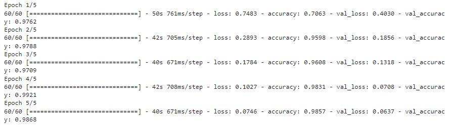
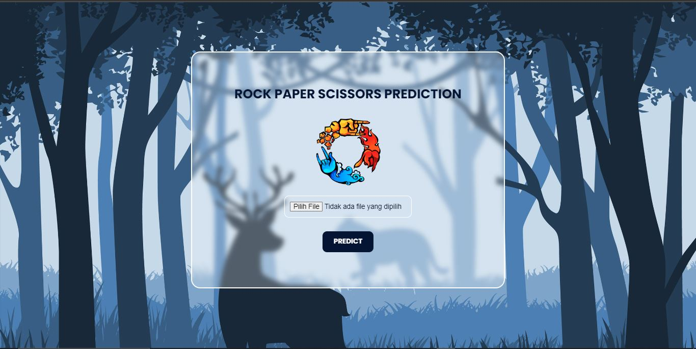
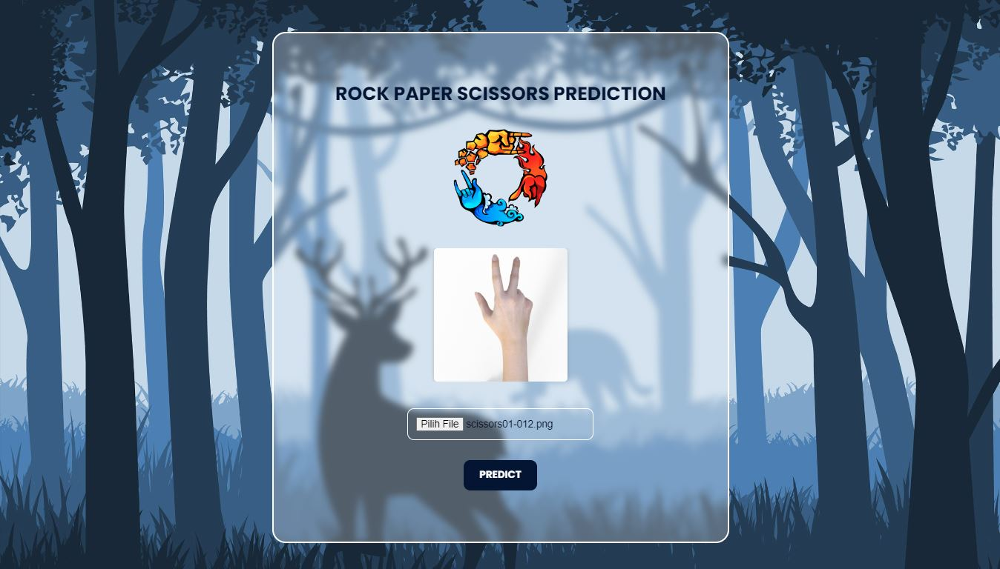
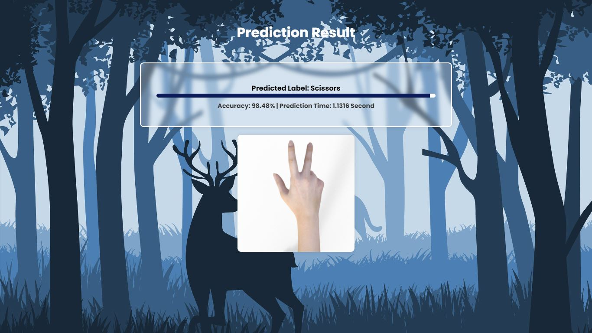

# RPS - Prediction

**Rock Paper Scissors Prediction**
Proyek ini bertujuan untuk melakukan klasifikasi gambar rock, paper, dan scissors menggunakan model transfer learning VGG19. Dengan menggunakan Flask, aplikasi web ini memungkinkan pengguna untuk mengunggah gambar tangan rock, paper, dan scissors, dan kemudian memberikan prediksi dari model VGG19 terhadap gambar tersebut.

### Fitur 
* Menggunakan arsitektur VGG19 untuk klasifikasi gambar rock, paper, dan scissors.
* Aplikasi web sederhana dengan antarmuka pengguna menggunakan Flask.
* Pengguna dapat mengunggah gambar dan menerima prediksi dari model VGG19.
* Menggunakan TensorFlow dan Keras sebagai dasar untuk pemodelan dan prediksi.

**Pre-Rquirements :**

- [x] numpy
- [x] opencv-python
- [x] pillow
- [x] Flask
- [x] Tensorflow

**Struktur Project :**
* /models: Direktori untuk menyimpan model VGG19 dan berkas terkait lainnya.
* /static: Direktori untuk menyimpan file statis seperti gambar, CSS, dan JavaScript.
* /templates: Direktori untuk menyimpan template HTML untuk antarmuka web Flask.
* app.py: Berkas utama yang berisi logika Flask dan rute aplikasi.

## Dataset
Dataset yang digunakan merupakan kumpulan citra tangan paper, rock, dan scissors yang berjumlah 2520 gambar.
Berikut merupakan contoh gambar dari masing masing kelas yang ada :

Dataset yang ada dibagi menjadi 3 bagian menjadi data train, validation, dan test, dengan proporsi 75%:15%:10%.
Setelah itu data dilakukan beberapa augmentasi yang disesuaikan untuk menambah variasi data yang dimiliki, berikut contoh hasil setelah dilakukan augmentasi :

## Model (VGG-19)
VGG-19 adalah salah satu arsitektur jaringan saraf konvolusional (CNN) yang dikembangkan oleh Visual Graphics Group (VGG) di Universitas Oxford. Arsitektur ini terdiri dari 19 lapisan (dilambangkan dengan "19" dalam namanya) termasuk lapisan konvolusi (convolutional layers), lapisan aktivasi ReLU (Rectified Linear Unit), dan lapisan pooling. VGG-19 dikenal karena kedalaman yang signifikan dalam strukturnya, dengan sebagian besar lapisan konvolusi yang memiliki filter 3x3 dan lapisan pooling yang menggunakan max pooling.

Salah satu alasan utama mengapa VGG-19 sering digunakan untuk prediksi citra adalah karena kekuatan representasinya. Beberapa faktor yang menjadikan model ini bagus untuk prediksi citra meliputi:
1. Kedalaman yang besar: Dengan memiliki 19 lapisan, VGG-19 dapat mempelajari representasi yang lebih abstrak dan kompleks dari gambar. Ini memungkinkannya untuk mengenali pola yang lebih mendalam dan kompleks dalam citra.
2. Receptive field yang luas: Dengan memanfaatkan filter kecil 3x3 secara berulang-ulang, VGG-19 dapat membangun "receptive field" yang luas, yang memungkinkannya untuk memahami konteks yang lebih besar dari citra.
3. Transfer Learning: Arsitektur VGG-19 sering digunakan dalam transfer learning, di mana model yang telah dilatih pada dataset besar (seperti ImageNet) dapat disesuaikan kembali (fine-tuning) untuk tugas klasifikasi citra yang lebih kecil. Ini karena representasi yang dipelajari oleh VGG-19 dianggap cukup universal dan berguna untuk berbagai tugas penglihatan komputer.
4. Performa yang baik: Meskipun sudah beberapa tahun, VGG-19 masih dianggap sebagai salah satu arsitektur yang kuat dan andal untuk pengenalan citra. Meskipun mungkin bukan yang tercepat, model ini telah menunjukkan performa yang baik dalam berbagai tugas pengenalan citra.

Dalam project ini model yang digunakan VGG-19, berdasarkan beberapa faktor diatas menjadi alasan mengapa model ini dipilih. Berikut ringkasan dari model VGG-19 yang sudah disesuaikan dengan case :

**Training :**
Berikut ini merupakan hasil dari training model VGG-19 (5 epoch) dengan menggunakan dataset yang ada :

Berikut adalah grafik plot dari hasil training loss dan val loss :

Ringkasan hasil training yang dihasilkan adalah sebagai berikut:
* Loss (Kehilangan) pada data pelatihan: 0.074
* Akurasi pada data pelatihan: 0.98 atau 98%
* Loss (Kehilangan) pada data validasi: 0.063
* Akurasi pada data validasi: 0.98 atau 98%

Hasil prediksi dari model yang sudah di train :

Hasil ini menunjukkan bahwa model yang telah dilatih memiliki kinerja yang sangat baik:
* Loss yang rendah pada data pelatihan (0.074) menunjukkan bahwa model hampir tidak memiliki kesalahan yang signifikan dalam mempelajari data pelatihan.
* Akurasi tinggi pada data pelatihan (0.98 atau 98%) menunjukkan bahwa model dapat dengan tepat mengklasifikasikan sebagian besar sampel pada data pelatihan.
* Loss yang rendah pada data validasi (0.063) menunjukkan bahwa model tidak mengalami overfitting yang signifikan dan dapat memgeneralisasi dengan baik pada data baru yang belum pernah dilihat.
* Akurasi tinggi pada data validasi (0.98 atau 98%) menunjukkan bahwa model juga dapat melakukan klasifikasi dengan sangat baik pada data yang tidak digunakan selama proses pelatihan.

## Aplikasi Website
Setelah hasil train dirasa cukup baik, model di simpan dalam format .h5. Setelah itu deployment model dengan aplikasi web menggunakan Flask Python.

**Tata Cara Menggunakan**
Clone repository berikut :
- git clone https://github.com/fauzanadrivano/RPS-Prediction/tree/main
- model https://drive.google.com/file/d/1JqPfrqNWVAK3pdgNa237SORBs_ComOuN/view?usp=drive_link

1. Pastikan Python telah diinstal di lingkungan Anda.
2. Instal semua dependensi yang diperlukan dengan menjalankan pip install -r requirements.txt.
3. Jalankan aplikasi Flask dengan perintah python app.py.
4. Buka browser dan akses http://localhost:5000.
5. Unggah gambar rock, paper, atau scissors dan lihat hasil prediksi dari model VGG19.

**Tampilan Aplikasi Web**

Tampilan awal

Upload gambar yang ingin diprediksi

Hasil prediksi

## Kesimpulan
Berdasarkan ringkasan hasil pelatihan yang diperoleh (Loss 0.074, Akurasi 0.98 pada data pelatihan; Val Loss 0.063, Val Akurasi 0.98 pada data validasi), dapat diambil beberapa kesimpulan penting:

* Kinerja Model yang Sangat Baik: Model yang dilatih menunjukkan kinerja yang sangat baik dengan tingkat akurasi yang tinggi (98%) baik pada data pelatihan maupun data validasi. Hal ini menandakan bahwa model mampu mengenali pola dan fitur dengan akurat dalam klasifikasi gambar rock, paper, dan scissors.
* Kesesuaian Model untuk Tugas Klasifikasi Citra: Dengan akurasi yang tinggi pada dataset yang digunakan, model VGG19 terbukti cocok dan efektif untuk tugas klasifikasi citra seperti dalam kasus pengenalan gambar rock, paper, dan scissors. Hal ini mengindikasikan bahwa representasi dan fitur yang dipelajari oleh model tersebut cukup mampu untuk membedakan objek-objek tersebut dalam gambar.
* Keandalan Model: Hasil yang konsisten antara data pelatihan dan data validasi menunjukkan bahwa model memiliki keandalan yang baik dan mampu menghasilkan prediksi yang konsisten pada dataset yang berbeda.
* Kemungkinan Penerapan Model: Dengan kinerja yang tinggi, model ini dapat memiliki aplikasi yang luas dalam mendukung pengenalan dan klasifikasi objek pada gambar dalam berbagai konteks, baik itu untuk aplikasi permainan, pengenalan gesture, atau sistem deteksi objek pada umumnya.

Hasil yang diperoleh menunjukkan bahwa model yang telah dilatih dengan menggunakan VGG19 pada dataset gambar rock, paper, dan scissors telah memberikan hasil yang sangat memuaskan dengan kinerja tinggi dan kemampuan yang baik dalam klasifikasi gambar, serta kemungkinan penerapan yang luas dalam berbagai konteks pengenalan objek pada citra.

## Author
- Fauzan Adrivano Setiono (202010370311312)
